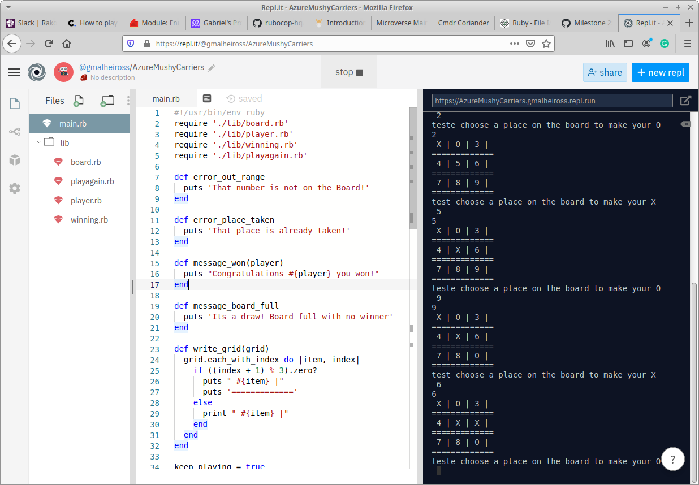

# Tic-Tac-Toe

In this project, we build a Tic Tac Toe game. The main goal is to put into practice the main concepts of Object Oriented Programming.
Particularly, classes and access to their attributes.



## Tic-Tac-Toe Rules

- Requires
2 people

- Game Play
One player (designated X) makes the first move by drawing that letter in any one of the 9 boxes; O follows by making the second move. The game can have only three outcomes: either player may emerge victorious by linking three of their letters horizontally, vertically, or diagonally, or else the game ends in a “cat’s game” in which neither player connects three in a row.

- Objective
However you arrive there, no matter the strategy — three in a row wins the game

## Getting Started

You can get a local copy of the repository please run the following commands on your terminal:

```
$ cd <folder>

$ git clone https://github.com/Stricks1/TicTacToe.git
```

To run the game, go to your terminal on the folder you saved and type: main
- At the beggining the game will ask players for their names
- The game will display the board, tells which player turn it is and asks to select from available moves
- The game will inform player if selected move is invalid and ask again until he type a valid move
- The game will display board after player move
- The game will repeat all actions for next player's move until there is a winner or the board is full
- The game will ask if you want to play again

## Built With

- Ruby

## Live Demo

[Live Demo Link](https://repl.it/@gmalheiross/AzureMushyCarriers)

## Authors

👤 **Author1**

- Github: [@Stricks1](https://github.com/Stricks1)
- E-mail: [Gabriel Silveira](mailto:gmalheiross@gmail.com)
- Linkedin: [Gabriel Silveira](https://linkedin.com/in/gabriel-malheiros-silveira-b6632061/)

👤 **Author2**

* Github: **[@rindrajosia](https://github.com/rindrajosia)**
* Twitter: **[@rindrajosia](https://twitter.com/josia_rindra)**
* Linkedin: **[linkedin](https://www.linkedin.com/in/rindra-josia-99b2111a2/)**

## 🤝 Contributing

Contributions, issues and feature requests are welcome!

Feel free to check the [issues page](https://github.com/Stricks1/TicTacToe/issues).

## Show your support

Give a ⭐️ if you like this project!

## Acknowledgments

 - Project from Microverse
 - Originally taken from The Odin Project
